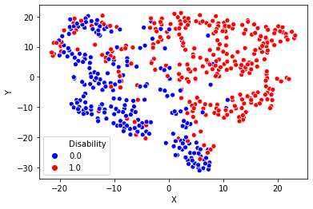
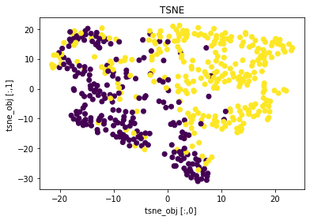
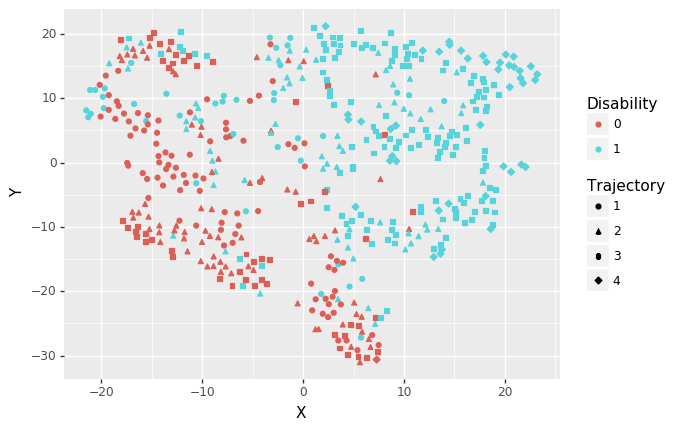
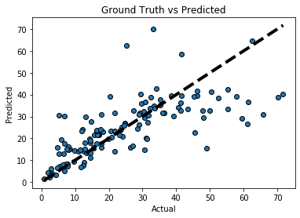
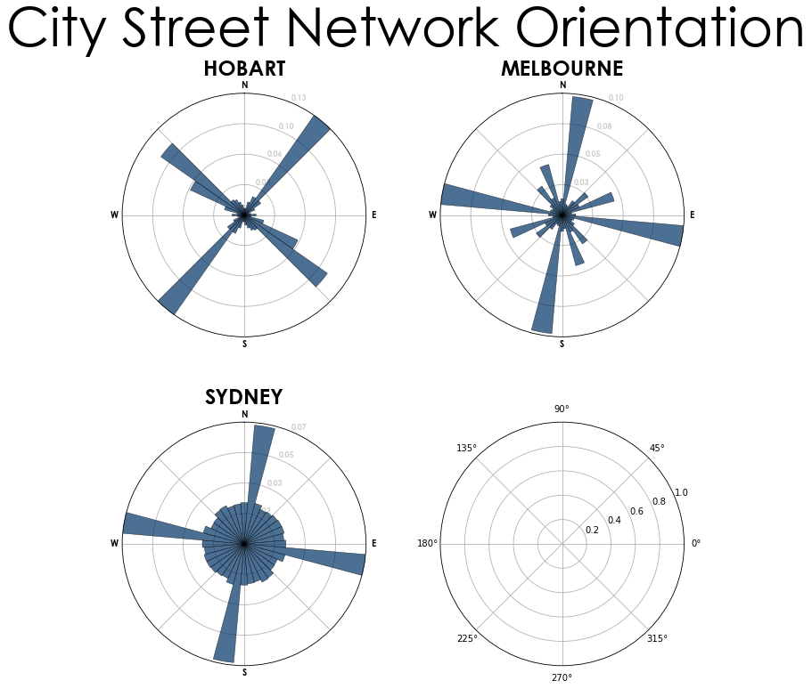

# python_journey
learning python

These codes are part of my journey learning python. 

## Data Wrangling

### Opening files 
The starting point for learning python is pandas. A small example is given below on opening of file in jupyter notebook. Documentation for pandas can be found at https://pandas.pydata.org/pandas-docs/stable/user_guide/.cThe file also contains illustration about opening of R files in the form of .Rda. You will need to import pyreadr and pyreadr.read_r("name of file.rda"). Xcel files like csv can be opened using pandas. You will need to import pandas as pd then run this line pd.read_csv("name of file.csv"). 

```python
import pandas as pd
import pyreadr 
pd.read_csv('name of file.csv')
```

## Handling dataframe

Pandas data frame can be merged using pd.concat([file1,file2],axis=1). The line axis=1 indicates that the merge is by columns. Similarly, dropping a column is performed by specifying drop after name of file such as file.drop (['name of column'],axis=1). Selecting a column from data frame can be done by writing file['name of column']. selcting multiple columns require [['name of column1','name of column2']].

### Wide vs Long format

Conversion from wide to long format:
For the time being the conversion from wide to long format is done in R. see the datawrangling.R file.

## Plot:

There are illustrations with 3 types of plot: seaborn, matplotlib and plotnine-ggplot style.

### Seaborn

The seaborn plot is shown. 
```python
import seaborn as sns
#tsne_df is a data frame with columns X, Y, Disability
sns.scatterplot(x="X", y="Y",
              hue="Positive",
              palette=['blue','red'],
              legend='full',
              data=tsne_df);
```
[](./Plot/TSNEecr.ipynb)

### Matplotlib

The matplotlib plot is shown.

```python
import matplotlib as plt
fig, ax = plt.subplots()
ax.scatter(tsne_obj [:,0], tsne_obj[:,1], c=y)
ax.set_xlabel('tsne_obj [:,0] ')
ax.set_ylabel('tsne_obj [:,1] ')
ax.set_title("TSNE")
plt.show() #plt calls the matplotlib
```


### Plotnine

The plotnine plot is shown. This is a ggplot style in python.

```python
from plotnine import *  
(ggplot (df)
 + geom_point(aes('X ', 'Y',color='factor(Disability)',shape='factor(Akmed)'))
)+labs(color="Disability",shape='Trajectory')
```


### Flow diagram

A file for creating flow is provided. It uses _pydot_ which interfaces with _graphviz_. Graphviz needs to be installed separately and the path set under environment C:\Program Files (x86)\Graphviz\bin

##  Machine learning

### Random Forest

This part focusses on machine learning and use sklearn. Random forest is , a supervised machine learning method related to decision tree analysis, which employed random selection of covariates and patients from the dataset to create multiple trees. This form of ensemble learning utilises ‘wisdom of the crowd’ to create the model. This example illustrates the use of _regression_ with random forest and a plot of observed vs predicted is provided in RFstandfirm.ipynb notebook. An example with random forest _classification_ is provided in the DrivingReg.ipynb notebook. The random forest model is evaluated using the library _shap_ to determine the contribution of the variables to the model.  This example comes with demo of creation of GUI for testing new data using the model created by random forest. 

[](./RandomForest/RFstandfirm.ipynb)

### TSNE

This part focusses on manifold learning and uses sklearn manifold tsne. The T-distributed Stochastic Neighbor Embedding example is provided below. The analysis shown here performs a low dimensional representation of the trajectory of stroke severity measurements in thrombectomy trials data. 

## Geospatial analysis

This part focusses on geospatial analysis and use the osmnx library. The tutorial paper is available [here](https://www.frontiersin.org/articles/10.3389/fneur.2019.00743/full). The [Brisbane.ipynb](./Geospatial/Brisbane.ipynb) python notebook deals with journey from Westin Hotel to surrounding building within 500 metres radius. A second example uses codes provided from osmnx for examining street network orientation in Australian Capital Cities. The [AustCities-Copy1.ipynb](./Geospatial/Austcities-Copy1.ipynb) note book is available in gh-pages. 

<


## Github Flavored Markdown

This document can be seen as a way to write document for viewing on the web especially github. Markdown files are denoted by .md extension and can be viewed similarly on Rstudio or Jupyter. Italics are denoted by _ underscore before and after a word or phrase. There are several differerent ways for adding images: using html tag or using square brackets follow by round brackets. Images can be resized using the html tag with the argument on width and height following _src_ argument. You can also send email by using @ follow by the username. An example would be @GNtem2.

## Git

A folder can be iniated using the following commands git init.  Use git fetch to download file from github. Git pull update the current head branch from remote folder. Git discusses local as the folder in your directory and remote as the repository in github.

```git
git init 
git remote add origin https://github.com/GNtem2/python_journey.git
git add README.md
git commit -m "update"
git push -u orgin master
```
